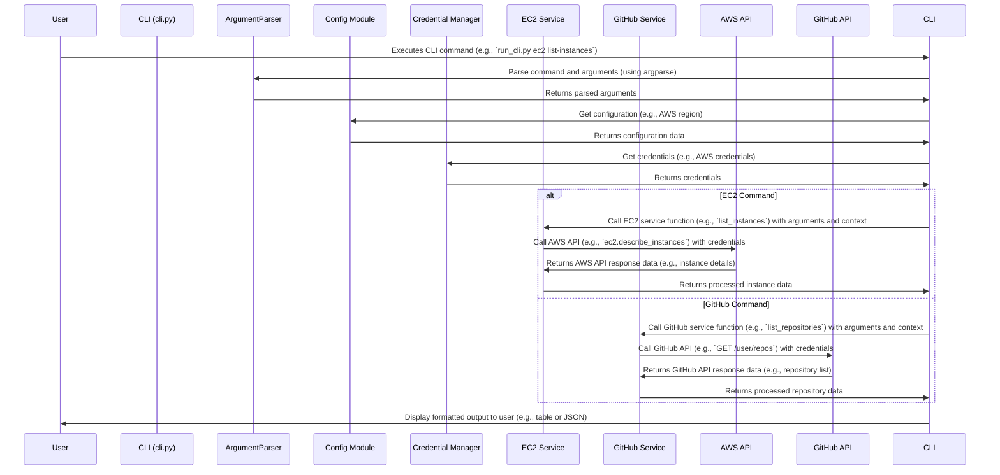

# Data Flow

## Overview

This document describes the data flow within the Agentic DevOps framework, illustrating how data is processed and passed between different components during typical operations.

## Data Flow Diagrams

### 1. Command Execution Data Flow



### 2. Agent Workflow Data Flow

```mermaid
sequenceDiagram
    participant Agent
    participant Runner
    participant Tool Registry
    participant Tool (e.g., list_ec2_instances)
    participant RunContext
    participant Guardrail System
    participant External Service (AWS, GitHub)

    User->>Runner: Start agent workflow with task input
    Runner->>Agent: Initialize agent with task and context
    Agent->>Tool Registry: Select appropriate tool based on task
    Agent->>RunContext: Access context information (e.g., region, credentials)
    Runner->>Guardrail System: Input Guardrail Check (e.g., security_guardrail)
    Guardrail System->>Runner: Returns guardrail check result
    alt Guardrail Passed
        Runner->>Tool: Execute tool (e.g., `list_ec2_instances`) with context
        Tool->>External Service: Interact with external service API (AWS, GitHub)
        External Service->>Tool: Returns API response data
        Tool->>Runner: Returns processed tool output
        Runner->>Agent: Provide tool output to agent
        Agent->>Runner: Generate final output or next action
        Runner->>Guardrail System: Output Guardrail Check (e.g., sensitive_info_guardrail)
        Guardrail System->>Runner: Returns output guardrail check result
        alt Guardrail Passed
            Runner->>User: Return final result to user
        else Guardrail Failed
            Runner->>User: Return guardrail violation message
        end
    else Guardrail Failed
        Runner->>User: Return guardrail violation message
    end
```

## Data Entities

- **Configuration Data**: Loaded from YAML/JSON files or environment variables. Managed by `config.py`. Includes settings for AWS, GitHub, logging, etc.
- **Credential Data**: AWS credentials (access key, secret key, token, region, profile) and GitHub token, managed by `credentials.py` and `CredentialManager`.
- **Context Data**: `DevOpsContext` object containing `user_id`, `aws_region`, `github_org`, `environment`, and metadata, managed by `context.py`.
- **Request Data**: User commands from CLI or task inputs for agents, typically strings or structured data.
- **Response Data**: JSON responses from AWS and GitHub APIs, processed by service modules and tools.
- **Output Data**: Formatted CLI output (JSON, table) or agent workflow results, which can be text, structured data, or actions.

This document provides a detailed overview of the data flow within the Agentic DevOps framework for both command execution and agent workflows.